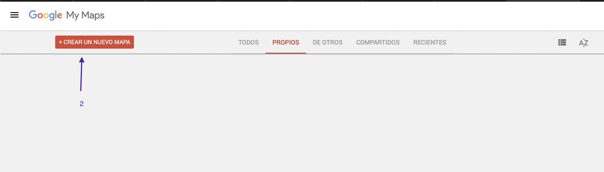
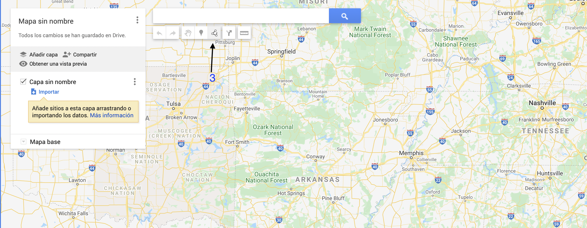
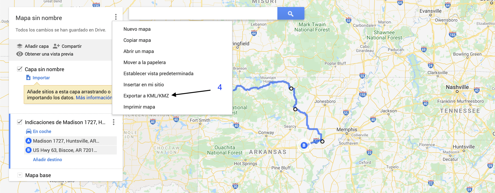
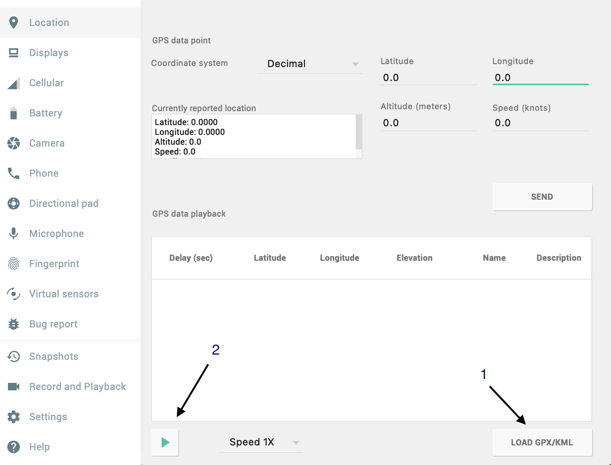

# Google Maps Api test using marker rotation and routes. 

## Features

* ✔️ Kotlin
* ✔️ DI:[ Hilt](https://developer.android.com/training/dependency-injection/hilt-android)
* ✔️ [View binding](https://developer.android.com/topic/libraries/view-binding)
* ✔️ [Coroutines](https://developer.android.com/topic/libraries/architecture/coroutines)
* ✔️ [AndroidX](https://developer.android.com/jetpack/androidx)
* ✔️ [Google Maps SDK](https://developers.google.com/maps/documentation/android-sdk/overview)


## Create your route
```
- Open https://www.google.com/mymaps
```








- Step 5: Open your Android Emulator



### How to build
```
1-Git clone
2-Use Android Studio(4.2 or up, Arctic Fox|2020.3.1 Beta 3 in my case) /File/Open
3-Sync Project with Gradle
```
* 4- Change DESTINATION location with your final LatLng [here](app/src/main/java/com/carlyadam/routes/data/api/ApiService.kt)
```
5- Add your google maps Api key
6-Run Project
7-Open you emulator settings like Step 5 and play the route. 
4-Done
```

Enjoy it ;)
